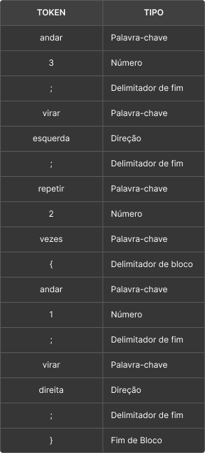

# Desafio 03 – Descrições Sintáticas e Semânticas

Para este desafio, pensou-se em uma linguagem para ensino da Robótica nas escolas. Buscando alinhamento com o projeto de extensão "Robótica nas Escolas", onde alunos do Campus da UFC - Crateús vão para a sala de aula, de turma do ensino médio e fundamental, ensinar princípios básicos de robótica. A linguagem "RoboBô" seria usada para auxiliar os alunos a entender a lógica de comandos e como a mesma influencia nas ações de dispositivos IoT.

---

## Linguagem: RoboBô

### Ações
Permitir o controle de um robô simples, que pode:
- Andar uma quantidade definida de passos;
- Virar à esquerda ou direita;
- Executar comandos em repetição.

Essa linguagem permite introduzir os conceitos de instrução sequencial, repetição e abstração de ações de forma lúdica.

---

## Gramática Sintática (estilo EBNF)

```ebnf
<programa>      ::= <comando> | <comando> <programa>
<comando>       ::= "andar" <num> ";"
                 | "virar" <direcao> ";"
                 | "repetir" <num> "vezes" "{" <programa> "}"
<direcao>       ::= "esquerda" | "direita"
<num>           ::= [0-9]+
```
## Análise Léxica

A análise léxica é a etapa em que o código-fonte é dividido em tokens, ou seja, unidades mínimas de significado. Cada token é classificado por tipo, como palavra-chave, número, delimitador, direção, etc.

Abaixo está a tabela de tokens gerada a partir do seguinte código RoboBô:

```
andar 3;
virar esquerda;
repetir 2 vezes {
    andar 1;
    virar direita;
}
```

## Análise Sintática

O código apresentado respeita todas as regras definidas na gramática da linguagem RoboBô. Cada comando está de acordo com uma das produções definidas:

- `andar 3;` corresponde à regra `"andar" <num> ";"`;
- `virar esquerda;` corresponde à regra `"virar" <direcao> ";"`;
- `repetir 2 vezes { ... }` corresponde à regra `"repetir" <num> "vezes" "{" <programa> "}"`, onde o bloco contém comandos válidos.

Portanto, a sequência completa de comandos é sintaticamente válida na linguagem definida.


## Semântica

A análise semântica garante que os comandos têm um significado lógico coerente com o comportamento esperado do robô. Veja a interpretação de cada instrução do exemplo:

- `andar 3;`  
  O robô move-se **3 unidades para frente** na direção atual.

- `virar esquerda;`  
  O robô gira **90° para a esquerda**.

- `repetir 2 vezes { ... }`  
  O bloco de comandos entre `{` e `}` será **executado duas vezes** consecutivas.

## Conclusão

A linguagem RoboBô permite representar, de forma didática, os conceitos fundamentais de **sintaxe** e **semântica** presentes em linguagens de programação reais. Além disso, seu uso no contexto do ensino de robótica torna o aprendizado mais acessível para estudantes da educação básica, estimulando o raciocínio lógico e a compreensão de como comandos computacionais se transformam em ações reais.
