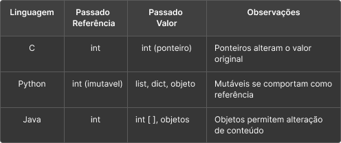

# Desafio 06 – Subprogramas

Este desafio tem como objetivo demonstrar a diferença entre passagem de parâmetros por valor e por referência em linguagem C. É interessante compreender esse conceitos para, com isso, entender o comportamento de variáveis dentro de funções e como manipular seus valores corretamente.

---

## Conceito

- Passagem por valor: A função recebe uma cópia da variável. Alterações feitas dentro da função não afetam o valor original.
- Por referência: A função recebe endereço da variável original (ponteiro). Alterações feitas dentro da função afetam diretamente o valor original.

---

## `alterarValor.c`

```c
#include <stdio.h>

void alterarPorValor(int x) {
    x = 100;
    printf("Alterar por valor x alterado para %d dentro da função.\\n", x);
}
void alterarPorReferencia(int *x) {
    *x = 100;
    printf("Alterar por referencia x alterado para %d dentro da função.\\n", *x);
}

int main() {
    int a = 10;
    int b = 10;

    printf("Antes de alterarPorValor, a = %d\\n", a);
    alterarPorValor(a);
    printf("Depois de alterarPorValor, a = %d\\n\\n", a);

    printf("Antes de alterarPorReferencia, b = %d\\n", b);
    alterarPorReferencia(&b);
    printf("Depois de alterarPorReferencia, b = %d\\n", b);

    return 0;
}

```

## `alterarValor.py`

```java
def alterar_por_valor(x):
    x = 100
    print("Alterar por valor x alterado para", x)

def alterar_por_referencia(x):
    x[0] = 100
    print("Alterar por referência x[0] alterado para", x[0])

a = 10
print("Antes de alterar_por_valor, a =", a)
alterar_por_valor(a)
print("Depois de alterar_por_valor, a =", a)
print()

b = [10]
print("Antes de alterar_por_referencia, b =", b)
alterar_por_referencia(b)
print("Depois de alterar_por_referencia, b =", b)

```

## `alterarValor.java`

```python
import java.util.*;

class SubprogramasJava {
    public static void alterarPorValor(int x) {
        x = 100;
        System.out.println("Alterar por valor x alterado para " + x);
    }

    public static void alterarPorReferencia(int[] x) {
        x[0] = 100;
        System.out.println("Alterar por referencia x[0] alterado para " + x[0]);
    }

    public static void main(String[] args) {
        int a = 10;
        int[] b = {10};

        System.out.println("Antes de alterarPorValor, a = " + a);
        alterarPorValor(a);
        System.out.println("Depois de alterarPorValor, a = " + a);
        System.out.println();

        System.out.println("Antes de alterarPorReferencia, b[0] = " + b[0]);
        alterarPorReferencia(b);
        System.out.println("Depois de alterarPorReferencia, b[0] = " + b[0]);
    }
}

```
---
## Comparação

---
## Conclusão
Através da comparação entre C, Python e Java, é possível observar como cada linguagem lida com a manipulação de variáveis em subprogramas:

- C: a manipulação explícita de ponteiros oferece controle direto sobre a memória, tornando clara a distinção entre cópia e referência.
- Python: o comportamento depende da mutabilidade dos objetos: imutáveis se comportam como por valor; mutáveis, como por referência.
- Java: tudo é tecnicamente passado por valor, inclusive objetos, mas o valor da referência é copiado, permitindo alterar o conteúdo interno de objetos e arrays.
