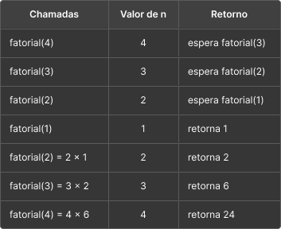
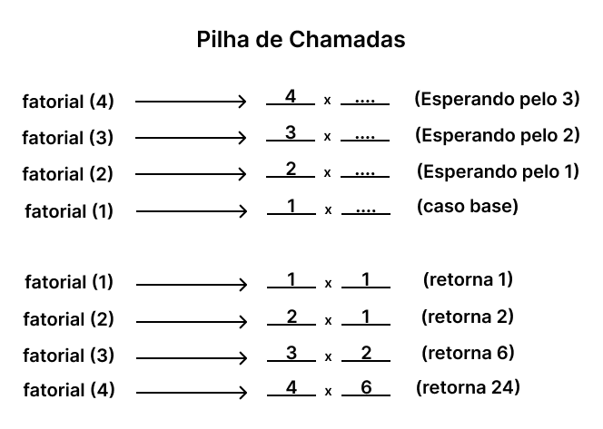

# Desafio 07 – Implementação de Pilha de Chamadas

Este desafio tem como objetivo demonstrar o funcionamento da pilha de chamadas em um exemplo de função recursiva. A função escolhida foi o cálculo do fatorial, um clássico que ilustra bem o empilhamento e desempilhamento de chamadas durante a recursão.

---

## Objetivo

- Implementar uma função recursiva simples;
- Explicar o funcionamento da pilha de chamadas (stack);
- Ilustrar como os valores são empilhados e retornados.

---

## `fatorial.c`

```c
#include <stdio.h>

int fatorial(int n) {
    if (n <= 1)
        return 1;
    else
        return n * fatorial(n - 1);
}

int main() {
    int num;
    printf ("Digite um valor para calcular o fatorial:\n");
    scanf("%d", &num);
    int resultado = fatorial(num);
    printf("\nFatorial de %d é %d\n", num, resultado);
    return 0;
}
```

---

## Recursão

Para `fatorial(4)`, a execução se desdobra da seguinte forma:

1. `fatorial(4)` chama `fatorial(3)`
2. `fatorial(3)` chama `fatorial(2)`
3. `fatorial(2)` chama `fatorial(1)`
4. `fatorial(1)` retorna 1
5. `fatorial(2)` recebe 1 e retorna `2 × 1 = 2`
6. `fatorial(3)` recebe 2 e retorna `3 × 2 = 6`
7. `fatorial(4)` recebe 6 e retorna `4 × 6 = 24`
---

## Pilha de chamadas


###Representação gráfica


---

## Conclusão
A função recursiva `fatorial` utiliza a pilha de chamadas para armazenar o estado de execução de cada nível da recursão até atingir o caso base. Após isso, os valores são desempilhados em ordem inversa, multiplicando os resultados e construindo o valor final. Esse comportamento de empilhar chamadas até o caso base e então retornar é característico de toda função recursiva.

