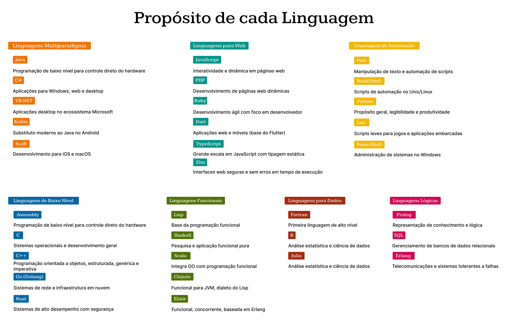

# Desafio 01 – Introdução às Linguagens de Programação

Este repositório apresenta a resolução do primeiro desafio da disciplina **Fundamentos de Linguagens de Programação**, cujo objetivo é contextualizar historicamente a evolução das linguagens de programação, bem como compreender os diferentes propósitos e paradigmas associados a cada uma.

## 1. Linha do Tempo das Linguagens de Programação

A imagem a seguir representa uma linha do tempo com os principais marcos históricos das linguagens de programação. As linguagens estão organizadas por categorias de paradigmas (funcional, lógica, automação, etc.) e por década de criação, permitindo visualizar a progressão e o surgimento de novos estilos e propósitos ao longo do tempo.

> 

## 2. Propósitos e Características das Linguagens

Complementarmente, o segundo quadro apresenta as linguagens agrupadas por domínio de aplicação (automação, web, dados, etc.) com foco em seus propósitos originais e principais características técnicas.

> 

## 3. Considerações Finais

A evolução das linguagens de programação acompanha diretamente o avanço da computação e as demandas da indústria e da ciência. Linguagens como **C** e **Assembly** representaram marcos na manipulação direta de hardware, enquanto outras como **Python**, **Rust** e **Kotlin** refletem preocupações modernas com legibilidade, segurança e produtividade.

A análise histórica e funcional aqui apresentada visa oferecer uma compreensão crítica sobre como diferentes linguagens surgiram para atender necessidades específicas, e como os paradigmas de programação evoluíram em resposta a desafios técnicos e sociais.
